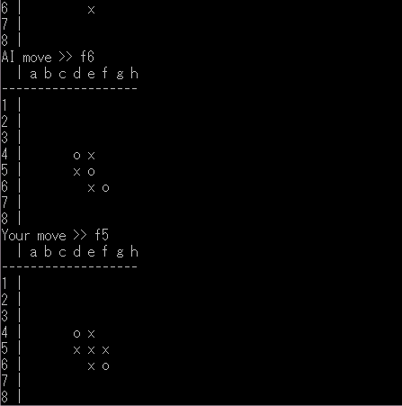

# Reversi AI DLL

Heuristic reversi AI implemented as a Windows native DLL

## Features

- Simple API
- Callable from C# easily
- Multithread supported
- Moderate AI Strength

## Dependencies

You may need Microsoft Visual C++ Redistributable.

- VCRUNTIME140.dll
- api-ms-win-crt-runtime-l1-1-0.dll
- KERNEL32.dll

## API

The DLL has simple API.
For instance, a board state is given, an API function returns a move you should to choose next.

### Bit Board

Bit Board is expression of a reversi board.
By Bit Board, a board state is expressed by a pair of 64-bit unsigned integer.
They each have bit flags where each players' disks are placed.
For example, an initial board of reversi is expressed like `0x0000_0008_1000_0000` and `0x0000_0010_0800_0000`.

### Functions

#### `int heuristic_search(unsigned long long self, unsigned long long opponent, int depth)`

Returns an approximately good move that `self` player should do by doing partial search.

`self` and `opponent` are Bit Board.
`depth` is anticipation steps same as depth of recursion.
It must be positive.
The returned value is a bit number expressing a disk position.
The bit number is 0 to 63.
Search time depends on depth of recursion.

#### `int heuristic_search_parallel(unsigned long long self, unsigned long long opponent, int depth)`

The multithreaded version of `heuristic_search`.

It's faster than the non-multithreaded version in most cases if the CPU is good enough for parallel calculation.

#### `int full_search(unsigned long long self, unsigned long long opponent)`

Returns the best move that `self` player should do by doing full search.

This can be used if the game is in its final stages.
`self` and `opponent` are Bit Board.
The returned value is a bit number expressing a disk position.
The bit number is 0 to 63.

#### `int full_search_parallel(unsigned long long self, unsigned long long opponent)`

The multithreaded version of `full_search`.

It's faster than the non-multithreaded version in most cases if the CPU is good enough for parallel calculation.

#### `int choose_move(unsigned long long self, unsigned long long opponent)`

Returns a move that `self` player should act.

This function is a wrapper of `heuristic_search` and `full_search`.
It switches between them considering search time.
`self` and `opponent` are Bit Board.
The returned value is a bit number expressing a disk position.
The bit number is 0 to 63.
Search time will be less than a few seconds usually.

#### `int choose_move_parallel(unsigned long long self, unsigned long long opponent)`

The multithreaded version of `choose_move`.

Thanks to speeding up by parallel calculation, this function tries to search deeper than the non-multithreaded version.
Moreover, it switches to full search earlier.
Use this multithreaded version instead to make AI stronger.

#### `int position_to_index(int i, int j)`

Returns a bit number from a horizontal index and a vertical index.

`i` and `j` are 0 to 7.
The returned bit number is 0 to 63.

#### `unsigned long long position_to_bit(int i, int j)`

Returns a 64-bit unsigned integer having one bit flag at a given board position.

`i` and `j` are 0 to 7.
This function can be used to compose a Bit Board from other data types.

#### `int index_to_position_i(int n)`

Returns a horizontal index from a bit number.

The bit number is 0 to 63.
The returned index is 0 to 7.
Use this function for the conversion of a bit number as AI result into a disk position.

#### `int index_to_position_j(int n)`

Returns a vertical index from a bit number.

The bit number is 0 to 63.
The returned index is 0 to 7.
Use this function for the conversion of a bit number as AI result into a disk position.

[See all functions (Header file)](ReversiAiDll/ReversiAiDll.h)

## Using with Unity

### Import the DLL

1. Copy each DLL of target architectures into an architecture-specified plugin folder inside of `Assets`
  - Win32 DLL into `Plugins/x86`
  - x64 DLL into `Plugins/x86_64`
2. (Windows only) Configure platform settings of the DLLs in Inspector to enable them in Editor for debugging

### Coding

First, import `System.Runtime.InteropServices` namespace for calling DLL functions.

```cs
using System.Runtime.InteropServices;
```

Next, import external functions from the DLL.

Define static methods with the `extern` modifier and `DllImport("ReversiAiDll")` attribute.
Declare them with the same names as DLL functions, or indicate function names to be imported by `EntryPoint` parameter of `DllImport`.
Make sure their type signatures match.
It is not necessary to use the same parameter names.

```cs
[DllImport("ReversiAiDll")]
private static extern int index_to_position_i(int n);

[DllImport("ReversiAiDll")]
private static extern int index_to_position_j(int n);

[DllImport("ReversiAiDll", EntryPoint = "choose_move_parallel")]
private static extern int ChooseMove(ulong self, ulong opponent);
```

Now these functions are able to be called.


```cs
// Prepare Bit Boards
ulong self = player1.ToBitBoard();
ulong opponent = player2.ToBitBoard();

// Use AI
int decision = ChooseMove(self, opponent);

// Extract answers
int i = index_to_position_i(decision);
int j = index_to_position_j(decision);
```

## Console application

This solution includes a Windows console application to try the AI.

### Usage

`ReversiConsole.exe [dark|light]`

The positional argument is your side.
It is dark by default.



## License

[Apache License 2.0](LICENSE)
