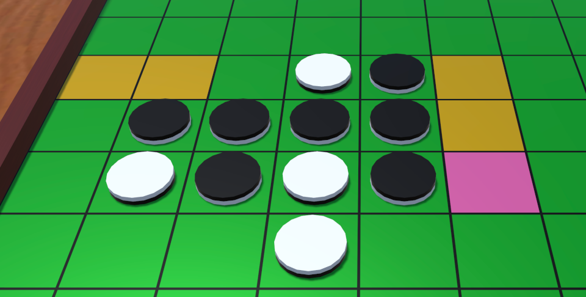

# Reversi AI DLL

Heuristic Reversi AI implemented as a Windows native DLL

This AI uses heuristic algorithms to determine the most effective move in any given scenario within a game of Reversi, also known as Othello.
It is designed with efficiency, speed, and complexity in mind, capable of making intricate decisions based on the current state of the game board.

A ported version of this project is also available in Rust: <https://github.com/curegit/reversi-ai>.

## Features

- Simple API
- Callable from C# easily
- Multithread supported
- Moderate AI Strength

## Dependencies

You may need Microsoft Visual C++ Redistributable to use `ReversiAiDll.dll`.

- KERNEL32.dll
- MSVCP140.dll
- VCRUNTIME140.dll
- api-ms-win-crt-heap-l1-1-0.dll
- api-ms-win-crt-runtime-l1-1-0.dll

## API

The DLL has simple API.
For instance, a board state is given, the API function returns a move you should choose next.

### Bit Board

Bit Board is expression of a Reversi board.
By Bit Board, a board state is expressed by a pair of 64-bit unsigned integers.
They each have bit flags where each players' disks are placed.
For example, an initial board of Reversi is expressed like `0x0000_0008_1000_0000` and `0x0000_0010_0800_0000`.

### Functions

#### int heuristic_search(unsigned long long self, unsigned long long opponent, int depth)

Returns an approximately good move that `self` player should do next by doing a partial search.

`self` and `opponent` are Bit Board.
`depth` is anticipation steps the same as the depth of recursion.
It must be positive.
The returned value is a bit number expressing a disk position.
The bit number is 0 to 63.
Search time depends on the depth of recursion.

#### int heuristic_search_parallel(unsigned long long self, unsigned long long opponent, int depth)

The multithreaded version of `heuristic_search`.

It's faster than the non-multithreaded version in most cases if the CPU is good enough for parallel calculation.

#### int heuristic_search_parallel_with(unsigned long long self, unsigned long long opponent, int depth, int concurrency)

Same as `heuristic_search_parallel` except you can specify the number of threads.

#### int full_search(unsigned long long self, unsigned long long opponent)

Returns the best move that `self` player should do next by doing a full search.

This can be used if the game is in its final stages.
`self` and `opponent` are Bit Board.
The returned value is a bit number expressing a disk position.
The bit number is 0 to 63.

#### int full_search_parallel(unsigned long long self, unsigned long long opponent)

The multithreaded version of `full_search`.

It's faster than the non-multithreaded version in most cases if the CPU is good enough for parallel calculation.

#### int full_search_parallel_with(unsigned long long self, unsigned long long opponent, int concurrency)

Same as `full_search_parallel` except you can specify the number of threads.

#### int choose_move(unsigned long long self, unsigned long long opponent)

Returns a move that `self` player should do next.

This function is a wrapper of `heuristic_search` and `full_search`.
It switches between them considering search time.
`self` and `opponent` are Bit Board.
The returned value is a bit number expressing a disk position.
The bit number is 0 to 63.
Search time will be less than a few seconds usually.

#### int choose_move_parallel(unsigned long long self, unsigned long long opponent)

The multithreaded version of `choose_move`.

Thanks to speeding up by parallel calculation, this function tries to search deeper than the non-multithreaded version.
Moreover, it switches to full search earlier.
Use this multithreaded version instead to make AI stronger.

#### int choose_move_parallel_with(unsigned long long self, unsigned long long opponent, int concurrency)

Same as `choose_move_parallel` except you can specify the number of threads.

#### int position_to_index(int i, int j)

Returns a bit number from a horizontal position and a vertical position.

`i` and `j` are 0 to 7.
The returned bit number is 0 to 63.

#### unsigned long long position_to_bit(int i, int j)

Returns a 64-bit unsigned integer having a one-bit flag at a given board position.

`i` and `j` are 0 to 7.
This function can be used to compose a Bit Board from other data types.

#### int index_to_position_i(int n)

Returns a horizontal position from a bit number.

The bit number is 0 to 63.
The returned index is 0 to 7.
Use this function for the conversion of a bit number as AI result, to a disk position.

#### int index_to_position_j(int n)

Returns a vertical position from a bit number.

The bit number is 0 to 63.
The returned index is 0 to 7.
Use this function for the conversion of a bit number as AI result, to a disk position.

[See all functions (Header file)](ReversiAiDll/ReversiAiDll.h)

## Use with Unity

### Import the DLL

Copy each DLL of target architectures into an architecture-specified plugin folder inside of `Assets`.

- Win32 DLL into `Plugins/x86`
- x64 DLL into `Plugins/x86_64`

Configure platform settings of the DLLs in Inspector to enable them in Editor for debugging (Windows only).

### Coding

First, import `System.Runtime.InteropServices` namespace for calling DLL functions.

```cs
using System.Runtime.InteropServices;
```

Next, import external functions from the DLL.

Define static methods with the `extern` modifier and `DllImport("ReversiAiDll")` attribute.
Declare them with the same names as DLL functions, or indicate function names to be imported by the `EntryPoint` parameter of `DllImport`.
Make sure their type signatures match.
It is not necessary to use the same parameter names.

```cs
[DllImport("ReversiAiDll")]
private static extern int index_to_position_i(int n);

[DllImport("ReversiAiDll")]
private static extern int index_to_position_j(int n);

[DllImport("ReversiAiDll")]
private static extern ulong position_to_bit(int i, int j);

[DllImport("ReversiAiDll", EntryPoint = "choose_move_parallel")]
private static extern int ChooseMove(ulong self, ulong opponent);
```

Now these functions are able to be called.

Finally, write codes that call AI functions.

```cs
// Prepare Bit Boards from collections of disk positions
ulong self = darkPositions.Aggregate(0ul, (a, p) => a | position_to_bit(p.x, p.y));
ulong opponent = lightPositions.Aggregate(0ul, (a, p) => a | position_to_bit(p.x, p.y));

// Use AI to decide the next move
int decision = ChooseMove(self, opponent);

// Extract answers
int x = index_to_position_i(decision);
int y = index_to_position_j(decision);
```

It takes a few seconds for AI to return an answer, so please use asynchronous methods.

## Unity Application

An illustrative Unity application (binary build) is available on [the release page](https://github.com/curegit/reversi-ai-dll/releases/latest).



## Console Application

This solution also includes a Windows console application to try on the AI.

### Usage

`ReversiConsole.exe [dark|light]`

The positional argument is your side.
It is dark by default.


## License

[Apache License 2.0](LICENSE)
